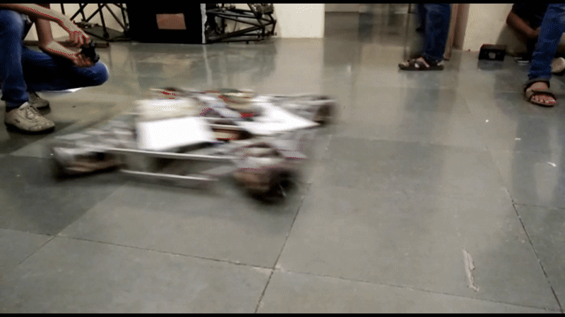

# 🚗 Robot Drive Systems

A collection of drive control systems for differential, 3-wheel omni, and 4-wheel omni robots using AVR microcontrollers and PS2 controller over Bluetooth.


## 📦 What This Project Includes

- **2-wheel car drive**
- **3-wheel omni-directional drive**
- **4-wheel omni-directional drive**

Each system includes:
- PWM motor control using joystick input  
- Kinematic mapping for respective wheel configurations  
- Bluetooth-based serial communication  
- AVR ATmega2560 code using Atmel Studio

## 🛠️ Components

| Component                  | Description |
|---------------------------|-------------|
| **Microcontroller**        | Atmel ATmega2560 |
| **Motors**                 | DC Gear Motors |
| **Motor Drivers**          | Dual H-Bridge (e.g., L298N, BTS7960) |
| **Controller**             | PS2-style Joystick Controller |
| **Communication Module**   | Bluetooth (HC-05 or HC-06) |
| **Power Supply**           | 12V battery pack or equivalent |

## 🎮 Controller Setup

- The controller communicates with the robot via **UART** using a **Bluetooth module**.
- The control logic uses:
  - **Left joystick**: Forward / Backward
  - **Right joystick**: Rotation or Side Motion (for omni bots)

| Joystick Axis | Function                |
|---------------|-------------------------|
| Left Y        | Forward / Backward      |
| Right X/Y     | Rotation or lateral motion (depending on mode) |

## 🔧 Flashing Instructions

1. Open the relevant project (2W, 3W, or 4W) in **Atmel Studio**  
2. **Build** the project – a `.hex` file will be generated in the `Debug/` folder  
3. Flash the `.hex` file to the ATmega2560 using any AVR flashing tool:
   - [AVRDUDE](https://www.nongnu.org/avrdude/)
   - [ProgISP](https://www.electrodragon.com/w/ProgISP)
   - AVR Studio Programmer, etc.

## 🚘 2-Wheel Car Drive


### 🔢 Kinematics

Standard differential drive system:

```c
Right_Wheel = y_vector - w_vector;
Left_Wheel  = y_vector + w_vector;
```
Where:
- `y_vector` = forward/backward input from joystick  
- `w_vector` = rotation vector from joystick

### ✅ Capabilities
- Linear motion
- In-place turning
- Arc turns

📄 **Code:** [`codes/2-wheel-car-drive/2-wheel-car-drive/main.c`](codes/2-wheel-car-drive/2-wheel-car-drive/main.c)  

## 🔺 3-Wheel Omni Drive


### 🔢 Kinematics

Omni-directional drive system using inverse kinematics:
```c
w1 = m - x - y
w2 = m + x - y
w3 = 2 * (m + y)
```
Where:
- `x`, `y` = translation vectors  
- `m` = rotation vector

### ✅ Capabilities
- Move freely in any direction
- Rotate on the spot

📄 **Code:** [`codes/3-wheel-drive/3-wheel-drive/main.c`](codes/3-wheel-drive/3-wheel-drive/main.c)  

## 🧲 4-Wheel Omni Drive


### 🔢 Kinematics

Four omni-wheels in an 'X' configuration:
```c
w1 = -x - y + m
w2 = x - y - m
w3 = x - y + m
w4 = -x - y - m
```
Where:
- `x`, `y` = joystick movement vector  
- `m` = rotation vector

### ✅ Capabilities
- Omnidirectional motion
- Strafing left/right
- Independent rotation

📄 **Code:** [`codes/4-wheel-drive/4-wheel-drive/main.c`](codes/4-wheel-drive/4-wheel-drive/main.c)  

##
© 2025 Sahil Rajpurkar. All rights reserved.